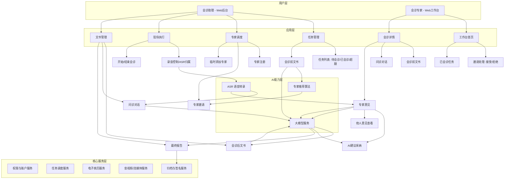
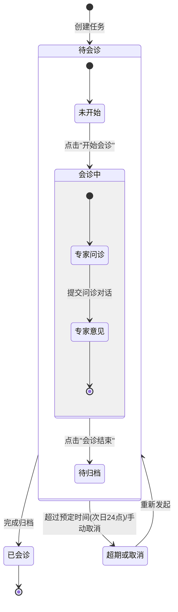
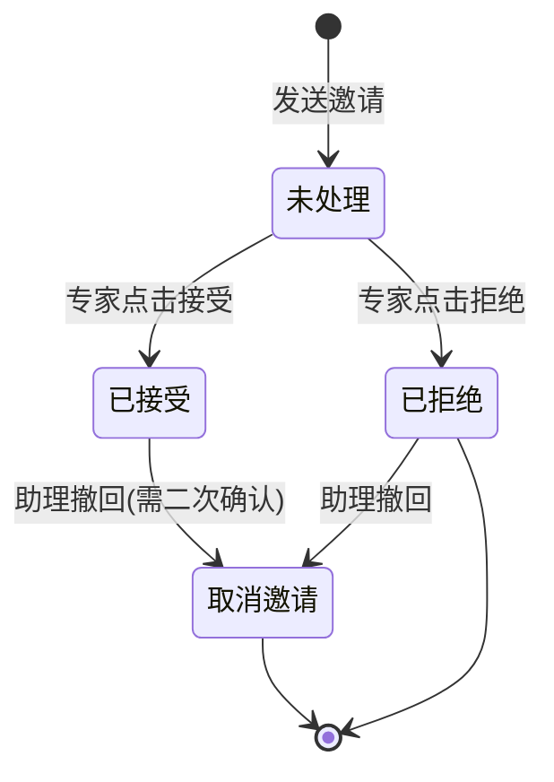
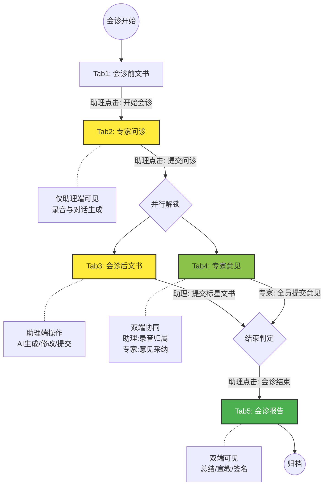

# MDT多端系统 - 产品需求文档 (PRD)

## 1. 文档介绍

### 1.1 文档目的
本文档旨在详细描述MDT（多学科诊疗）多端系统的产品功能需求、业务流程、用户交互及系统规则。作为产品设计、开发、测试及验收的依据，确保技术团队准确理解业务需求，高效交付符合预期的产品。

### 1.2 文档范围
本文档覆盖MDT多端系统的全功能模块，主要包括：
*   **会诊后台（助理端）**：任务管理、专家调度、现场问诊配合、文书审核与管理。
*   **会诊专家工作台（专家端）**：任务接收、病历查看、远程/现场意见发表、协同会诊。
*   **AI与核心算法**：专家推荐、ASR语音转录、大模型文书生成与清洗、智能结构化意见总结。
*   **数据与归档**：全流程电子病历归档、电子签名、报告生成。

### 1.3 读者对象
*   **项目经理**：了解项目整体范围与进度基准。
*   **UI/UE设计师**：进行界面交互与视觉设计。
*   **开发工程师（前端/后端/算法）**：进行系统架构设计、功能开发与算法实现。
*   **测试工程师**：编写测试用例，进行功能与性能测试。
*   **业务方/运营人员**：理解系统功能，进行验收与后续运营规划。

### 1.4 修订记录
| 版本号 | 修订日期 | 修改描述 | 修改人 | 审核人 |
| :--- | :--- | :--- | :--- | :--- |
| V1.0 | 2025-12-16 | 初始版本创建，基于原始需求描述细化 | 助手 | - |

## 2. 产品概述

### 2.1 产品背景
传统的MDT会诊通常依赖人工记录和整理，过程繁琐、效率低下且信息易疏漏。为了提升多学科会诊的效率和质量，需要构建一套集成了会诊助理后台和专家工作台的多端系统。该系统利用先进的AI、ASR（语音识别）和大模型技术，辅助会诊全流程，从任务发起、专家调度、现场问诊记录，到结构化意见生成及最终报告归档，实现智能化、规范化管理。

所有的场景和需求均运行在内网环境下，确保数据安全。

### 2.2 产品目标
1.  **流程数字化**：实现会诊任务创建、专家邀请、问诊、意见发表、报告生成的全流程线上闭环。
2.  **效率智能化**：通过AI专家推荐、ASR实时转录、大模型自动生成文书及结构化意见，大幅减轻人工记录负担。
3.  **协同高效化**：明确会诊助理与专家的角色分工与交互权限，实现多端实时协同。
4.  **数据规范化**：通过结构化的字段定义和归档标准，沉淀高质量的MDT会诊数据。

### 2.3 用户角色描述
| 角色 | 描述 | 主要职责 |
| :--- | :--- | :--- |
| **会诊助理** | MDT会诊的组织者和执行者 | 1. **任务管理**：新增会诊任务，录入会诊前文书。   2. **专家调度**：基于AI推荐邀请专家，管理专家库，现场临时添加专家。   3. **现场执行**：控制会诊流程（开启会诊、录音控制、页面跳转），操作ASR录音归属。   4. **文书负责**：审核和修改AI生成的文书（问诊对话、会诊后文书、报告、宣教意见），最终提交报告。 |
| **会诊专家** | 参与MDT会诊的各科室专家 | 1. **任务响应**：注册账号，接收或拒绝会诊邀请。   2. **信息获取**：查看会诊前文书，旁听/阅读问诊对话。   3. **意见贡献**：独立发表会诊意见，采纳AI建议或手工修改，提交结构化意见。   4. **报告确认**：提供电子签名，用于最终报告签署。 |

## 3. 总体设计
### 3.1 核心业务流程

核心业务流程覆盖了从任务发起到最终报告归档的全生命周期，严格遵循页面权限解锁顺序，主要分为三个阶段：

#### 1. 会诊准备阶段（任务与资源就绪）
*   **前提条件**：患者已在门诊系统挂号；助理已完成线下访谈。
*   **任务创建与管理**：
    *   助理在【后台-待会诊】新建任务，录入【会诊前文书】（含既往史、家族史等必填/选填项）。
    *   任务自动按时间排序，超期任务（预定时间次日24:00后）自动流转至【超期或取消】列表。
*   **专家调度与审核**：
    *   系统基于前文书内容AI推荐专家类型。
    *   助理勾选专家并发起邀请（支持临时新增专家类型）。
    *   **专家注册**：新专家通过H5/小程序注册（含姓名、科室、多选专家类型），助理在后台审核通过后入库。
    *   **邀请反馈**：专家在工作台处理邀请（接受/拒绝），拒绝需二次确认；助理可撤回已接受的邀请（需二次确认）。

#### 2. 现场会诊阶段（多端协同与AI辅助）
*   **流程启动**：助理在详情页点击“开始会诊”，系统状态流转为“会诊中”，**解锁【专家问诊】Tab**。
*   **问诊记录（助理端独有）**：
    *   助理控制麦克风进行现场录音，ASR实时转录。
    *   暂停录音时自动提交片段，AI清洗生成【问诊对话】。
    *   支持录音过程中切换至【会诊前文书】页面查看信息，不中断录音。
*   **阶段切换**：助理提交问诊对话（二次确认），**系统解锁【会诊后文书】（助理端）和【专家意见】（双端）Tab**，自动跳转。
*   **协同作业（并行进行）**：
    *   **智能文书（助理）**：AI即时生成【会诊后文书】（含现病史、体格检查等字段），助理可修改、隐藏非必填字段、暂存草稿。最终提交的版本将标星，并向专家端同步。
    *   **结构化意见（专家/助理）**：
        *   **助理操作**：点击对应专家的麦克风记录发言，系统高亮显示当前发言人，ASR转录并由AI生成结构化意见。
        *   **专家操作**：在工作台查看本人意见，采纳AI建议（勾选补充条目）或手动修改后提交。亦可查看他人已提交的意见。

#### 3. 总结归档阶段（报告生成与闭环）
*   **结束判定**：前置条件满足（助理已提交会诊后文书 + 所有在场专家已提交意见）后，助理点击“会诊结束”。
*   **核心专家指定**：弹窗选择本次会诊的【核心专家】（权重更高）。
*   **报告解锁**：系统**解锁【会诊报告】Tab**。
*   **报告生成**：AI综合生成【会诊总结】及【健康宣教意见】。
*   **最终签署**：助理复核修改总结内容，提交后生成包含所有专家电子签名的最终报告。
*   **完整归档**：系统保存全过程数据（前文书、多版本后文书、问诊录音/对话、各专家原始/结构化意见、最终报告）至电子病历服务。

### 3.2 功能架构图

### 3.3 页面流转与状态机

#### 3.3.1 会诊任务状态机

> **说明**：任务状态驱动列表流转。
> *   **超期判定**：若当前时间超过预定会诊时间次日的24:00仍未开始，系统自动将任务置为“超期”。
> *   **取消保护**：对于已接受邀请的任务，取消时需进行醒目二次提醒；普通任务取消需简单二次确认。

#### 3.3.2 专家邀请状态机

#### 3.3.3 会诊详情页权限流转（Tab解锁机制）

> **核心逻辑**：详情页包含5个Tab，随流程进展逐步解锁。专家端不显示【专家问诊】Tab。

## 4. 功能需求说明 - 会诊后台 (助理端)
### 4.1 会诊任务管理
#### 4.1.1 待会诊任务列表
*   **功能描述**：展示所有尚未开始会诊的任务，支持任务管理与状态查看。
*   **列表字段**：
    *   **会诊时间**（默认排序）：按时间正序排列（最早的时间排在最前）。
    *   **患者信息**：姓名、性别、年龄、主诉。
    *   **专家邀请状态**：以“专家姓名（状态）”格式展示，例：`张三（未接受）、李四（已接受）、王五（拒绝）`。
*   **操作功能**：
    *   **详情**：点击跳转至会诊详情页，默认展示【会诊前文书】Tab。
    *   **修改**：支持修改【会诊前文书】内容、【会诊时间】及【专家邀请】配置。
    *   **取消**：
        *   **操作交互**：点击“取消”按钮，弹出**醒目二次确认提示**（如红色警告弹窗）。
        *   **提示文案**：“警告！您正在取消会诊任务！”。
        *   **结果**：确认取消后，任务流转至【4.1.3 超期或取消任务管理】列表。

#### 4.1.2 已会诊任务列表
*   **功能描述**：展示所有已完成归档的历史会诊任务。
*   **列表字段**：会诊时间（倒序）、患者基本信息（姓名/性别/年龄/主诉）、参与专家列表。
*   **操作功能**：
    *   **详情**：点击进入详情页，查看完整的归档数据（含全过程文书、录音、报告）。

#### 4.1.3 超期或取消任务管理
*   **功能描述**：归集异常终止的任务，支持重新激活。
*   **数据来源**：
    *   **超期自动流转**：预定会诊时间次日24:00仍未开始的任务。
    *   **手动取消流转**：从【待会诊】列表手动取消的任务。
*   **列表字段**：会诊时间、患者基本信息、任务状态（超期/手动取消）。
*   **操作功能**：
    *   **详情**：查看任务历史信息。
    *   **重新发起**：点击后跳转至【新增会诊任务】页面，自动回填原有患者数据，便于快速重建任务。

#### 4.1.4 新增会诊任务与文书录入
*   **前置场景**：助理已完成线下访谈。
*   **功能入口**：【待会诊】页面 -> “新增任务”按钮。
*   **会诊前文书字段定义**：
    *   **必填项**：患者姓名、性别、年龄、主诉、现病史、目前治疗方案、本次会诊目的。
    *   **选填项（标*）**：既往史、个人史、婚育史、月经史（男性隐去）、家族史、辅助检查、精神检查、神经系统查体。
        *   *逻辑*：选填项若未填写，在详情页和后续AI生成中不予显示。
*   **后台处理**：任务创建成功后，系统自动启动虚拟专家会诊逻辑，生成预置的AI专家意见（在详情页展示）。

#### 4.1.5 专家调度与邀请管理
*   **专家设定与推荐**：
    *   **会诊时间**：设定精确到上下午及排序号（如：2025-12-15 下午 1号）。
    *   **AI智能推荐（交互细节）**：
        *   系统根据【会诊前文书】内容实时分析并推荐适合的专家类型。
        *   助理勾选专家时，界面右侧的推荐列表实时响应：**已选中的推荐类型高亮/颜色反转**。
        *   **强制提交**：无论勾选专家是否完全覆盖推荐列表，均允许保存提交。
*   **邀请发送与状态**：
    *   **自动邀请**：任务提交后，系统自动向所有被选专家发送系统通知。
    *   **三态管理**：
        *   `未接受`：默认状态。
        *   `已接受`：专家确认参加。
        *   `拒绝`：专家无法参加。
*   **撤回邀请（修改模式下）**：
    *   **低风险撤回**（针对`未接受`或`拒绝`）：点击移除，提示“确定取消邀请吗？”。
    *   **高风险撤回**（针对`已接受`）：点击移除，弹出醒目红色警告“警告！您正在取消已经接受邀请的专家！”。

### 4.2 专家库管理

#### 4.2.1 专家注册审核
*   **功能描述**：管理专家的准入资格，审核注册信息。
*   **注册信息定义**：
    *   **姓名**：实名认证。
    *   **临床科室**：所属科室。
    *   **专家类型**（多选）：支持同时具备多个标签，如同时属于“精神科”和“心理治疗”。
    *   **电子签名**：专家手写签名的电子档（图片），存档后用于会诊报告自动签署。
*   **审核流程**：
    *   **列表展示**：按注册时间倒序展示待审核申请。
    *   **操作**：通过/驳回。审核通过后，专家即刻进入专家库，可被搜索和邀请。

#### 4.2.2 专家类型与科室管理
*   **功能描述**：维护系统内的专家分类标签。
*   **预设专家类型**：系统初始化包含：精神科、神经内科、心理治疗、物理治疗、影像科、药剂科、营养科、儿童青少年精神科、老年精神科。
*   **自定义添加**：
    *   支持助理在后台动态添加新的专家类型标签。
    *   新增类型即时生效，可用于后续的专家注册及AI推荐匹配。
### 4.3 会诊详情页 (多页签系统)

会诊详情页是系统的核心工作区，采用分步解锁的多页签（Tab）设计，确保业务流程的规范性和数据的完整性。

#### 4.3.1 Tab1: 会诊前文书
*   **默认状态**：进入详情页默认展示此Tab。
*   **可见性**：助理端（可编辑）、专家端（只读）。
*   **功能描述**：
    *   **信息展示**：展示患者基本信息及所有已录入的病史信息。
    *   **虚拟专家意见**：系统在任务创建时自动生成的预置AI专家意见（基于标准诊疗指南），展示在文书下方供参考。
    *   **开始会诊（助理端特有）**：
        *   页面右上角展示“开始会诊”按钮。
        *   点击后，系统状态流转为“会诊中”，**解锁Tab2（专家问诊）**。
        *   若当前时间早于预定时间，给予提示但不阻断。

#### 4.3.2 Tab2: 专家问诊 (现场录音与清洗)
*   **解锁条件**：助理点击“开始会诊”后解锁。
*   **可见性**：**仅助理端可见**，专家端不可见（专家端此阶段仅能查看前文书）。
*   **功能描述**：
    *   **录音控制**：
        *   **麦克风操控**：点击“开始问诊”/“暂停”/“继续”。
        *   **多任务处理**：录音过程中，助理可切换回Tab1查看病史信息，**录音不中断**（后台保持采集）。
    *   **ASR实时转录**：
        *   现场语音实时转文字，滚动展示在界面左侧。
    *   **问诊对话生成（右侧记录栏）**：
        *   每次点击“暂停”或长时间静音，系统自动截取片段提交大模型清洗。
        *   **清洗结果**：生成可阅读的【问诊对话】（区分医生/患者角色，去除口语废话）。
        *   **人工修正**：助理可对清洗后的对话文本进行手动编辑修正。
*   **阶段流转**：
    *   **“提交问诊”**：助理点击提交，弹出二次确认“是否结束问诊进入下一阶段？”。
    *   **确认后动作**：
        *   解锁 **Tab3（会诊后文书）** 和 **Tab4（专家意见）**。
        *   助理端和专家端页面自动跳转至 **Tab4（专家意见）**。
        *   系统后台触发【会诊后文书】的AI生成任务。

#### 4.3.3 Tab3: 会诊后文书 (AI生成与管理)
*   **解锁条件**：助理提交问诊后解锁。
*   **可见性**：
    *   **助理端**：完全编辑权限。
    *   **专家端**：初始不可见/灰显，**仅当助理点击“提交”后，专家端才可见（只读）**。
*   **AI自动生成**：
    *   **输入**：会诊前文书 + 所有已暂存的问诊对话。
    *   **输出字段**：主诉、现病史、既往史*、个人史*、婚育史*、月经史*、家族史*、辅助检查*、精神检查*、神经系统查体*、目前治疗方案。
*   **助理操作功能**：
    *   **编辑与隐藏**：
        *   支持修改所有字段内容。
        *   **字段隐藏**：对于非必填（标*）字段，支持点击“隐藏”，隐藏后字段置灰，不出现在最终报告中。非标*字段不允许隐藏。
        *   **去隐藏**：支持恢复已隐藏的字段。
    *   **版本管理 (草稿箱)**：
        *   **暂存**：手动保存当前编辑状态至草稿箱。
        *   **重新生成**：点击“文书生成”，若当前内容未保存则自动暂存，然后发起新的AI生成请求（基于最新问诊数据）。
        *   **版本切换**：在草稿箱列表中点击不同版本，回填至编辑区。
    *   **提交**：
        *   点击“提交”后，当前版本被标记为**【正式版】（标星）**。
        *   **同步动作**：即时向所有在线专家端推送更新，专家端可查看该文书。
        *   支持“取消提交”进行回退修改，再次提交时刷新专家端内容。

#### 4.3.4 Tab4: 专家意见 (多端协同核心)
*   **解锁条件**：助理提交问诊后解锁。
*   **可见性**：双端可见，交互功能不同。
*   **界面布局**：
    *   **专家卡片区**：显示所有受邀专家（如：专家1-张三、专家2-李四）及【公共讨论区】。
    *   **状态标识**：专家卡片显示状态颜色（如：灰色-未发言，录音中-动效，绿色-已提交）。

*   **助理端操作 (主持人模式)**：
    *   **角色归属录音**：
        *   点击某专家卡片（例如“张三”）上的麦克风图标，开始录音。
        *   **视觉反馈**：对应卡片显示**绿色背景**，醒目提示“当前发言人：张三”。
        *   **ASR归档**：录音内容实时转录并归档至该专家的原始记录下。
        *   **操作限制**：每位专家的麦克风**只有一次点击机会**（避免插话），需一次性表达清楚。
    *   **切换发言人**：直接点击另一位专家（例如“李四”）的麦克风，自动结束上一位的录音并触发AI总结，同时开始新专家的录音。
    *   **公共讨论**：点击【专家讨论】的麦克风，记录的内容仅作为原始音频/文本留存，**不触发结构化意见生成**，**允许反复点击**追加录音。
    *   **临时加专家**：支持点击“+”号，从专家库中现场搜索并添加临时参会专家。

*   **专家端操作 (个人工作台)**：
    *   **查看他人**：可以展开查看其他已提交专家的意见（缩进显示），促进观点交流。
    *   **编辑本人意见**：
        *   **AI结构化总结**：当助理结束该专家的录音后，AI基于ASR内容自动生成【结构化意见】。
        *   **AI建议采纳**：AI基于上下文分析，在右侧推荐【补充意见条目】。专家勾选条目后点击“采纳”，内容自动融合进左侧编辑框。
        *   **手工修改**：专家可直接编辑意见文本。
    *   **提交**：
        *   点击“提交”按钮。
        *   **同步**：该专家的卡片在助理端和其他专家端变为绿色（已完成）。

*   **阶段流转**：
    *   **前提检查**：
        1.  【会诊后文书】已提交（即Tab3有标星版本）。
        2.  所有在场专家均已点击“提交”意见。
    *   **“会诊结束”**：
        *   助理点击按钮，系统校验前提条件（未满足则弹窗提示缺项）。
        *   **核心专家指定**：弹窗列表展示所有参会专家，助理勾选本次的【核心专家】（可多选或不选）。
            *   *作用：核心专家的意见在后续报告生成中权重更高。*
        *   **确认后动作**：解锁 **Tab5（会诊报告）**。

#### 4.3.5 Tab5: 会诊报告 (总结与归档)
*   **解锁条件**：会诊结束并指定核心专家后解锁。
*   **AI自动生成**：
    *   **数据源**：会诊后文书 + 各专家结构化意见（权重加权）。
    *   **生成内容**：
        1.  **会诊总结**：综合性诊疗建议。
        2.  **健康宣教意见**：针对患者的日常护理、康复建议。
*   **助理操作**：
    *   人工复核并修改AI生成的总结与宣教内容。
    *   点击“提交报告”。
*   **归档与签名**：
    *   提交后，报告自动附加所有参会专家及助理的电子签名（调用注册时保存的签名）。
    *   生成最终版PDF/电子病历数据包。
    *   **归档记录清单**：
        1.  **会诊前文书**（完整内容）。
        2.  **会诊后文书**（仅保存：AI初始生成版本、最终提交版本）。
        3.  **专家问诊**（完整问诊对话）。
        4.  **意见发表**（含：ASR原始记录、AI初次结构化内容、专家AI采纳情况、结构化最终提交内容）。
        5.  **会诊总结**（AI生成原始版本、助理修改后版本）。
        6.  **健康宣教意见**（AI生成原始版本、助理修改后版本）。
    *   系统状态更新为“已会诊”，任务归档。

## 5. 功能需求说明 - 专家工作台 (专家端)

### 5.1 专家工作台首页
#### 5.1.1 待会诊任务列表
*   **列表分类**：
    *   **未处理**：展示新收到的邀请。
        *   操作：点击卡片进入详情页；直接在列表点击“接受”或“拒绝”。
        *   **拒绝交互**：点击“拒绝”时，弹出**醒目二次提醒**：“警告！您正在拒绝会诊邀请”。若确认拒绝，任务归入拒绝列表且**无法再接受**。
    *   **已接受**：展示已确认参加的任务。
        *   操作：点击进入详情页等待会诊开始。
    *   **拒绝**：误操作拒绝的任务归入此列（注：已拒绝任务无法直接恢复，需助理重新邀请）。
*   **卡片信息**：会诊时间、患者基本信息（脱敏）、当前邀请状态。

#### 5.1.2 已会诊任务回顾
*   展示所有本人参与且已归档的历史任务。
*   支持随时回看完整的病历与报告。

#### 5.1.3 已拒绝任务记录
*   展示历史拒绝的任务记录，用于留痕。

### 5.2 会诊详情页 (专家视角)
*   **Tab视图差异**：
    *   **会诊前文书**：始终可见，只读。
    *   **专家问诊**：**始终不可见**，保护问诊过程中的隐私或减少干扰。
    *   **会诊后文书**：仅当助理提交后可见，只读。
    *   **专家意见**：
        *   **交互原则**：**与助理端功能完全不重叠**（见需求 #15）。
        *   **权限**：无法切换发言人录音。
        *   **本人意见**：支持勾选**AI补充条目**（点击“意见采纳”融合）、手工编辑文本、提交意见。
        *   **他人意见**：可点击查看被缩进的其他专家结构化意见，促进交流。
    *   **会诊报告**：仅会诊结束后可见，只读。

## 6. 核心算法与逻辑规则

### 6.1 AI推荐算法
*   **触发时机**：助理设定专家时。
*   **输入特征**：患者主诉、现病史关键词、既往史标签。
*   **输出**：专家类型列表（排序）。
*   **交互表现**：高亮匹配的专家类型标签。

### 6.2 ASR与大模型处理逻辑
*   **ASR转录**：支持流式传输，低延迟上屏；需处理医学专业术语。
*   **问诊清洗Prompt**：
    *   去除口语、重复语、无效语气词。
    *   区分 `[医生]` 和 `[患者]` 角色。
*   **文书生成Prompt**：
    *   **触发源**：基于【会诊前文书】 + 所有已暂存的【问诊对话】。
    *   **更新机制**：每次重新生成时，若当前草稿未保存则自动暂存，并基于最新的问诊对话全量重新生成。
*   **意见总结Prompt**：
    *   提取专家发言中的核心观点、诊断倾向、治疗建议。
    *   **双层生成**：
         1. **结构化意见**：标准的医学表述。
         2. **补充意见条目**：基于上下文分析的候选项，供专家勾选采纳（采纳后融合进结构化意见）。
*   **报告生成Prompt**：
    *   整合多专家意见，遇到冲突观点时，优先保留【核心专家】的意见，或并列展示。
    *   **健康宣教生成**：基于【会诊后文书】和【会诊总结】自动生成个性化护理与康复建议。

### 6.3 页面权限与协同规则

#### 6.3.1 角色视图差异
*   **会诊助理**：拥有全量视图，包含全部5个Tab：`【1.会诊前文书】`、`【2.专家问诊】`、`【3.会诊后文书】`、`【4.专家意见】`、`【5.会诊报告】`。
*   **会诊专家**：**不包含** `【2.专家问诊】` Tab，仅包含其余4个Tab。专家侧聚焦于病历查阅与意见发表，无需操作语音转录过程。

#### 6.3.2 阶段性解锁与访问控制
本系统采用严格的单向流程控制，页面解锁状态与会诊阶段强耦合：

| 会诊阶段 | 助理端权限 (Assistant) | 专家端权限 (Expert) | 触发条件/备注 |
| :--- | :--- | :--- | :--- |
| **1. 待会诊** | 仅 `Tab1` 可操作 | 仅 `Tab1` 可查看 | 初始状态，其余Tab均为锁定（置灰不可点）。 |
| **2. 问诊中** | `Tab1`, `Tab2` 可操作 其余锁定 | `Tab1` 可查看 **Tab2不可见** 其余锁定 | 助理在详情页点击【开始会诊】触发。 |
| **3. 意见发表** | `Tab1`, `Tab3`, `Tab4` 可操作 `Tab5` 锁定 | `Tab1`, `Tab4` 可操作 **Tab3 初始锁定** | 助理在Tab2点击【结束问诊】触发。 助理和专家自动跳转至Tab4。 |
| **4. 文书同步** | 同上 | `Tab1`, **Tab3**, `Tab4` 可查看 | 助理在Tab3点击【提交】后，**解锁专家端Tab3**并刷新内容。 |
| **5. 报告生成** | 全Tab解锁 (可修改总结) | 全Tab解锁 (仅查看) | 助理在Tab4点击【会诊结束】触发。 |

#### 6.3.3 实时协同规则
*   **强制跳转**：当助理切换关键会诊阶段（如从“问诊”转入“意见发表”）时，通过WebSocket指令强制所有在线专家端跳转至对应新页面。
*   **录音权互斥**：在 `Tab4(专家意见)` 页面，同一时间仅允许**会诊助理**控制麦克风权限（点击某位专家的发言按钮）。
*   **内容同步**：
    *   **文书更新**：助理提交 `Tab3` 后，专家端即时收到通知并解锁/刷新该Tab。
    *   **意见广播**：任意专家提交意见后，实时推送至助理端及其他专家端界面。

## 7. 数据与归档需求

### 7.1 归档内容规范 (全量保存)
根据合规要求，归档记录必须包含以下所有数据项：

1.  **会诊前文书**：最终提交的完整内容。
2.  **专家问诊**：
    *   原始录音文件。
    *   AI清洗后的问诊对话文本。
    *   助理手工修改后的最终【问诊对话】。
3.  **会诊后文书**：
    *   **仅保存提交版本**（标星版本）对应的数据：
        1. AI初始生成版本。
        2. 助理修改并最终提交的版本。
4.  **意见发表 (专家意见)**：
    *   ASR原始记录（含语音及转录文本）。
    *   AI第一次生成的结构化意见内容。
    *   专家AI意见采纳情况（操作记录）。
    *   专家最终提交的结构化意见内容。
5.  **会诊总结**：
    *   AI生成的原始版本。
    *   助理修改后的最终版本。
6.  **健康宣教意见**：
    *   AI生成的原始版本。
    *   助理修改后的最终版本。
7.  **最终患者侧报告**：
    *   包含上述提交版内容的合成文档。
    *   **签名信息**：附上所有与会专家和会诊助理的电子签名。

### 7.2 电子签名
*   **采集与复用**：用户（助理/专家）在注册账号时一次性采集电子签名（手写板/上传图片），后续会诊报告直接复用。
*   **合成应用**：最终生成的患者侧报告中，自动根据参会人员列表合成对应的电子签名，保障文书法律效力。

## 8. 非功能需求
### 8.1 性能需求
*   **音频延迟**：ASR上屏延迟 < 500ms。
*   **AI生成速度**：单次文书/意见生成耗时 < 5s。
*   **并发支持**：支持至少 50 场会诊同时进行。

### 8.2 安全需求
*   **内网部署**：所有数据传输在内网环境。
*   **隐私保护**：患者列表页对敏感信息（如身份证号）进行掩码处理。
*   **数据操作留痕**：所有的修改、删除操作均记录后台日志。

### 8.3 硬件兼容性
*   **麦克风**：适配主流全向麦克风阵列，支持回声消除与降噪。
*   **终端**：适配PC Web端（Chrome/Edge最新版）及主流Pad浏览器。

## 9. 附录
*   附录A：相关医学术语表
*   附录B：数据字典定义
